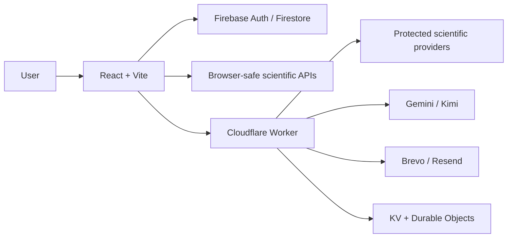
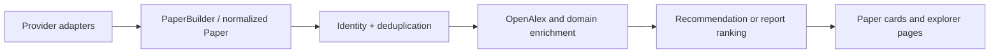

# PaperTok Architecture

## Overview

PaperTok is a React single-page application deployed on GitHub Pages with a Cloudflare Worker
for secret-bearing and server-side integrations.

## Frontend

`src/App.jsx` defines the authenticated routes:

- `/`: personalized For You feed
- `/research`: scientific report and trends
- `/following`: ranked feed from followed entities
- `/search`: cross-entity search
- `/lists`: personal reading library
- `/settings`: account and recommendation preferences
- `/explorer/:type/:id`: authors, institutions, projects, topics, and concepts

Application providers are user-scoped in this order:

1. authentication
2. interface language
3. followed entities
4. followed updates
5. email notifications
6. feed and recommendation state

## Paper Pipeline

Provider-specific payloads should not leak into components when a normalized field exists.
Stable DOI, arXiv, OpenAlex, or provider IDs drive identity. Title-based matching is a final
fallback.

The recommendation engine combines bounded signals for explicit preferences, learned
affinity, followed entities, recency, citations, semantic relevance, exploration, and
diversity.

## Persistence

- Firebase Authentication owns user identity.
- Firestore stores profiles, follows, interactions, preferences, and reading data.
- Browser storage is used only for bounded caches and must be namespaced by user when it
  contains personalized state.
- Cloudflare KV stores notification and usage state.
- Scheduled digests query native arXiv categories directly before falling back to OpenAlex,
  avoiding the indexing delay for newly submitted physics and mathematics papers.
- AI explanations bound PDF acquisition and provider retries within the browser request
  deadline, while provider JSON is normalized before LaTeX-aware rendering.
- The Kimi budget ledger uses a Durable Object for atomic monthly reservations.

## Worker

The Worker entry point is `worker/report-api.js`. Its route groups include:

- health and locale: `/health`, `/health/email`, `/health/ai`, `/locale`
- discovery: `/report/trends`, `/related`, `/citation-graph`, `/arxiv`
- open access: `/oa`
- specialist sources: `/sources/*`
- AI: `/ai/explain`
- notifications: `/notifications/*` (authenticated preferences include the active `es`/`en` locale used by digest and unsubscribe copy)

The browser calls the Worker through `VITE_PAPER_API_BASE_URL`. Worker credentials are stored
with `wrangler secret put`.

## Deployment

- A push to `main` runs `.github/workflows/deploy.yml` and publishes `dist/` to GitHub Pages.
- The Worker is deployed independently with `npx wrangler deploy`.
- Frontend and Worker contracts must remain backward compatible during staggered deployments.
